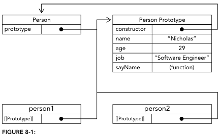
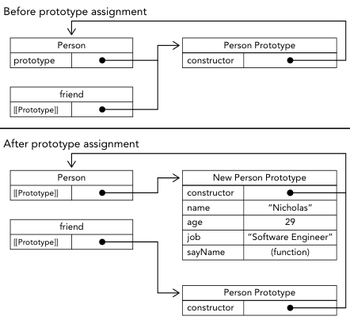
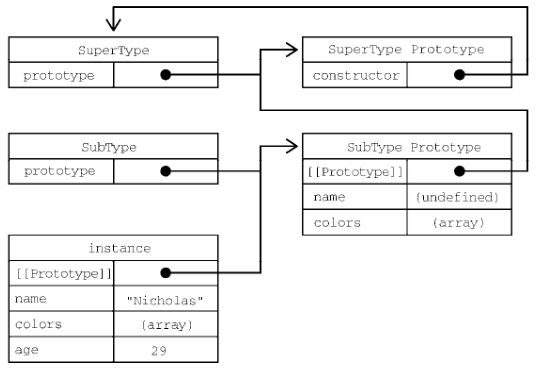
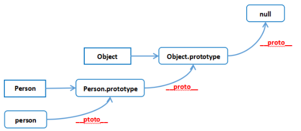

# 对象

## 基础

##### 创建 object

```typescript
// 构造函数
let person = new Object();
// 对象字面量
let person = {};
// Object.create()
const person2 = Object.create(person);
```

##### 定义属性

```typescript
person.name = "Nicholas";
people["name"] = "Nicholas";
let person = {
  name: "Nicholas";
};
```

##### object 中的属性名转换

- 数字转化为字符串;
- 字符串和标识符转换成标识符;

```typescript
let people = new Object();
people[5] = true;
console.log(people); // { '5': true }

people.name = "kxh";
console.log(people); // { name: 'kxh' }
people["name"] = "kxh";
console.log(people); // { name: 'kxh' }
```

## 对象进阶

### 对象属性

- 表示属性值行为, 必须通过 defineProperty() 自定义;
- 属性行为;
  - configurable: 表示属性可被删除/重新定义, 默认为 true;
  - enumerable: 表示属性可枚举, 应用于 for-in 循环, 默认为 true;
  - writable: 表示属性值可被改变, 默认为 true;
  - value: 表示属性值, 默认为 undefined;
  - get: 当属性被读时调用的函数, 默认值为 undefined;
  - set: 当属性被写时调用的函数, 默认值为 undefined;
    - 只定义 get, 表明只读;
    - 只定义 set, 表示只写;

### 属性值简写

```typescript
let name = "Matt";
let person = {
  name,
};
```

### 可计算属性

```typescript
// 可计算属性
const jobKey = "job";
let person = {
  [nameKey]: "Matt",
}; // { name: 'Matt' }
console.log(person); // { name: 'Matt' }
```

### 简写方法名

```typescript
let person = {
  sayName(name) {
    console.log("My name is ${name}");
  },
};
```

### Object 解构

```typescript
let person = {
  name: "Matt",
  age: 27,
};

let { name, job } = person;

function printPerson(foo, { name: personName, age: personAge }, bar) {
  console.log(arguments);
  console.log(personName, personAge);
}
printPerson("1st", person, "2nd");
```

## 设计模式

### 工厂模式

```typescript
// 无法自定义返回对象类型
function createPerson(name, age, job) {
  let o = new Object();
  o.name = name;
  o.age = age;
  o.job = job;
  o.sayName = function () {
    console.log(this.name);
  };
  return o;
}
let person1 = createPerson("Nicholas", 29, "Software Engineer");
```

### 构造函数模型

##### 创建构造函数

- 只能使用普通函数形式定义;
- 创建一个新对象;
  - object 的 \[\[prototype\]\] 赋值 constructor function 的 prototype 属性;
  - constructor function 的 this 指向 object;
  - 执行 constructor function 内部代码;
  - 返回 object;
- 不同 Person 实例的 constructor 指向 Person;

```typescript
function Person(name, age, job) {
  this.name = name;
  this.age = age;
  this.job = job;
  this.sayName = function () {
    console.log(this.name);
  };
}

let person1 = new Person("Nicholas", 29, "Software Engineer");
let person2 = new Person("Greg", 27, "Doctor");
console.log(person1.constructor === Person); // true
console.log(person2.constructor === Person); // true
// Person 实例可被表示为自定义类型
console.log(person1 instanceof Person); // true
```

##### 构造函数 new 的 this 指向

- 使用 new, 视为构造函数, this 指向 object;
- 不使用 new(), 视为普通函数, this 默认指向 global;

```typescript
let person = new Person("Nicholas", 29, "Software Engineer");
person.sayName(); // "Nicholas"
Person("Greg", 27, "Doctor"); // adds to window
window.sayName(); // "Greg"
```

### 原型模式

##### prototype 属性机制

- 每当创建一个 function, 自动定义一个 prototype 属性, 指向原型对象;
  - 原型对象为一个 object;
  - 原型对象自动定义一个 constructor 属性;
  - constructor 属性指向 function;
- 若 function 为 constructor function;
  - 根据 constructor function 创建的实例自动定义一个 \[\[prototype\]\],
  - 实例的 \[\[prototype\]\] 指向 constructor function 的 prototype 属性;
  - 不同实例指向同一个 prototype 属性;
  - \[\[prototype\]\] 在浏览器中往往使用 \_\_proto\_\_ 属性;
- 因为构造函数也有可能是另一个构造函数的示例, 从而导致原型链的形成;



##### 对象属性的访问流程

- 一个属性被访问;
- 首先根据其名称在实例本身进行搜索;
- 若未找到, 再从实例指向的 prototype 中进行搜索;

##### 重写 prototype 问题

```typescript
// 对象实例仅有对 prototype 的引用
function Person() {}
let friend = new Person();
Person.prototype = {
  constructor: Person,
  name: "Nicholas",
  age: 29,
  job: "Software Engineer",
  sayName() {
    console.log(this.name);
  },
};
friend.sayName(); // error
```



## 常用 API

- Object(value?: any): any 构造函数: 将 value 包装为对象;
- Object.assign(target: object, ...sources: object[]): object 静态方法: 将所有可枚举的自有属性从一个或多个源对象复制到目标对象;
- Object.create(proto: object | null, propertiesObject?: PropertyDescriptorMap): object 静态方法: 创建一个新对象, 使用现有对象作为新创建对象的原型;
- Object.defineProperties(obj: object, props: PropertyDescriptorMap): object 静态方法: 在一个对象上定义新的属性或修改现有属性;
- Object.defineProperty(obj: object, prop: string | symbol, descriptor: PropertyDescriptor): object 静态方法: 在一个对象上定义新的属性或修改现有属性;
- Object.entries(obj: object): [string, any][] 静态方法: 返回给定对象自身可枚举属性的键值对数组;
- Object.freeze(obj: object): object 静态方法: 冻结对象, 使其不可修改;
- Object.fromEntries(entries: Iterable<[PropertyKey, any]>): object 静态方法: 将键值对列表转换为对象;
- Object.getOwnPropertyDescriptor(obj: object, prop: string | symbol): PropertyDescriptor | undefined 静态方法: 返回指定对象上一个自有属性对应的属性描述符;
- Object.getOwnPropertyDescriptors(obj: object): PropertyDescriptorMap 静态方法: 返回指定对象所有自有属性的属性描述符;
- Object.getOwnPropertyNames(obj: object): string[] 静态方法: 返回指定对象所有自身属性的属性名(包括不可枚举属性);
- Object.getOwnPropertySymbols(obj: object): symbol[] 静态方法: 返回指定对象自身所有 symbol 属性;
- Object.getPrototypeOf(obj: object): object | null 静态方法: 返回指定对象的原型;
- Object.groupBy<K, T>(items: Iterable<T>, keySelector: (item: T, index: number) => K): Record<string, T[]> 静态方法: 根据 keySelector 分组;
- Object.hasOwn(obj: object, prop: PropertyKey): boolean 静态方法: 判断对象是否包含指定属性;
- Object.is(value1: any, value2: any): boolean 静态方法: 判断两个值是否为同一个值;
- Object.isExtensible(obj: object): boolean 静态方法: 判断对象是否可扩展;
- Object.isFrozen(obj: object): boolean 静态方法: 判断对象是否被冻结;
- Object.isSealed(obj: object): boolean 静态方法: 判断对象是否被密封;
- Object.keys(obj: object): string[] 静态方法: 返回指定对象自身可枚举属性的键名;
- Object.preventExtensions(obj: object): object 静态方法: 阻止对象扩展;
- Object.seal(obj: object): object 静态方法: 密封对象, 阻止添加新属性并标记现有属性为不可配置;
- Object.setPrototypeOf(obj: object, prototype: object | null): object 静态方法: 设置对象的原型;
- Object.values(obj: object): any[] 静态方法: 返回指定对象自身可枚举属性的键值;

### 枚举顺序

- 以下操作无明确枚举顺序;
  - for-in;
  - Object.keys();
- 以下操作有明确枚举顺序
  - 枚举顺序;
    - 先数字属性升序排列,
    - 后字符串和 symbol 根据插入顺序排列;
  - 方法/函数;
    - Object.getOwnPropertyNames();
    - Object.getOwnPropertySymbols;
    - Object.assign();

## 继承

### 原型链

##### 原型链

```typescript
function SuperType() {
  this.property = true;
}
SuperType.prototype.getSuperValue = function () {
  return this.property;
};
function SubType() {
  this.subproperty = false;
}
SubType.prototype = new SuperType();
SubType.prototype.getSubValue = function () {
  return this.subproperty;
};

// SubType 通过原型链访问到 SuperType.prototype.getSuperValue
let instance = new SubType();
console.log(instance.getSuperValue()); // true
```


##### 原型链问题

- SuperType 属性共享, 某一实例的引用值属性的修改会导致所有引用值属性的修改;
- SubType 创建时无法传递参数至 SuperType;

### 盗用构造函数

##### 盗用构造函数

```typescript
function SuperType(name) {
  this.name = name;
}
function SubType() {
  // 继承 SuperType 属性并传递参数
  SuperType.call(this, "Nicholas");
  this.age = 29;
}
let instance = new SubType();
console.log(instance.name); // "Nicholas";
console.log(instance.age); // 29
```

##### 盗用构造函数缺点

- SuperType() 中的方法无法复用;
- 无法使用 SuperType.Prototype 中的方法;

### 组合继承

##### 组合继承

- 原型链和盗用构造函数的结合;
- 使用 prototype chaining 继承 prototype 上的属性;
- 使用 Constructor Stealing 继承 constructor function 上的属性;

```typescript
function SuperType(name) {
  this.name = name;
  this.colors = ["red", "blue", "green"];
}
SuperType.prototype.sayName = function () {
  console.log(this.name);
};
function SubType(name, age) {
  // 继承 SuperType 属性
  SuperType.call(this, name);
  this.age = age;
}
// 继承 SuperType 方法
SubType.prototype = new SuperType();
SubType.prototype.sayAge = function () {
  console.log(this.age);
};
```



##### 缺点

- 调用两次 SuperType();
- SubType 的 prototype 具有冗余属性;

### 寄生式继承

- 原型链继承的改进;
- 少了一个 SuperType 实例;

```typescript
// 等效于 Object.create(o);
function object(o) {
  function F() {}
  F.prototype = o;
  return new F();
}

function createAnother(original) {
  // 首先继承 original 属性和方法
  let clone = object(original);
  // 创建自己实例属性
  clone.sayHi = function () {
    console.log("hi");
  };
  return clone;
}
```

### 寄生式组合继承

- 结合寄生继承和组合继承;

```typescript
function Sup(name) {
  this.name = name;
}

Sup.prototype.sayName = function () {
  console.log(this.name);
};

function Sub(name, age) {
  Sup.call(this, name);
  this.age = age;
}

function MyCreate(obj) {
  function fn() {}
  fn.prototype = obj;
  return new fn();
}

Sub.prototype = MyCreate(Sup.prototype);
Sub.prototype.sayAge = function () {
  console.log(this.age);
};

const p1 = new Sup("kxr");
const p2 = new Sub("kxh", 25);
p1.sayName(); // kxr
p2.sayName(); // kxh
p2.sayAge(); // 25
```

## 最佳实践

### 不可修改的对象

- 使用 Object.freeze();
- 定义 object writable 属性;
- 定义 object set 属性;

### 数据劫持

##### 使用 Object.defineProperty()

- 通过 Object.defineProperty() 和订阅者模式实现响应式;
- 通过遍历 object 属性, 在 getter 和 setter 中添加订阅逻辑;
- 修改 object 属性, 触发 setter 对应订阅逻辑;

```typescript
const obj = {
  name: "刘逍",
  age: 20,
};
const p = {};
for (let key in obj) {
  Object.defineProperty(p, key, {
    get() {
      console.log(`${key}属性被读取`);
      return obj[key];
    },
    set(val) {
      console.log(`${key}属性被修改`);
      obj[key] = val;
    },
  });
}
```

##### 使用 Proxy 和 Reflect

- 使用 Proxy 创建 obj 代理;
- 通过 Reflect 修改 obj;

```typescript
const obj = {
  name: "刘逍",
  age: 20,
};

const p = new Proxy(obj, {
  get(target, propName) {
    console.log(`${propName}属性被读取`);
    return Reflect.get(target, propName);
  },

  set(target, propName, value) {
    console.log(`${propName}属性被修改`);
    Reflect.set(target, propName, value);
  },

  deleteProperty(target, propName) {
    console.log(`${propName}属性被删除`);
    return Reflect.deleteProperty(target, propName);
  },
});
```

### a == 1 && a == 2 && a == 3

##### 重写 toString() 或 valueOf()

- 对于数组和对象皆可以;

```typescript
let a = {
  i: 1,
  toString: function () {
    return a.i++;
  },
};
console.log(a == 1 && a == 2 && a == 3); // true

let a = [1, 2, 3];
a.toString = a.shift;
console.log(a == 1 && a == 2 && a == 3); // true
```

##### 使用 Object.defineProperty()

```typescript
var _a = 1;
Object.defineProperty(globalThis, "a", {
  get: function () {
    return _a++;
  },
});
console.log(a === 1 && a === 2 && a === 3); //true
```

### 复杂的原型链

- 实例的 \_\_proto\_\_ 指向构造函数的 prototype;
- 构造函数也是一个函数对象, 其 \_\_proto\_\_ 指向 Function.prototype;
- 原型对象是一个普通对象, 其 \_\_proto\_\_ 指向 Object.prototype;
- Object 本身也是一个函数对象, 其 \_\_proto\_\_ 指向 Function.prototype;
- Object 的 prototype 也有 \_\_proto\_\_ 指向 null;

```typescript
person1.__proto__ === Person.prototype;
Person.__proto__ === Function.prototype;
Person.prototype.__proto__ === Object.prototype;
Object.__proto__ === Function.prototype;
Object.prototype.__proto__ === null;
```


