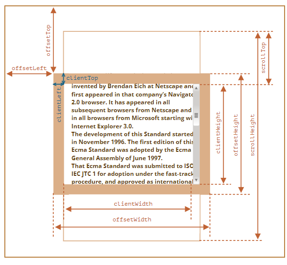
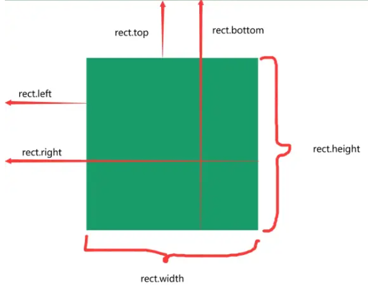
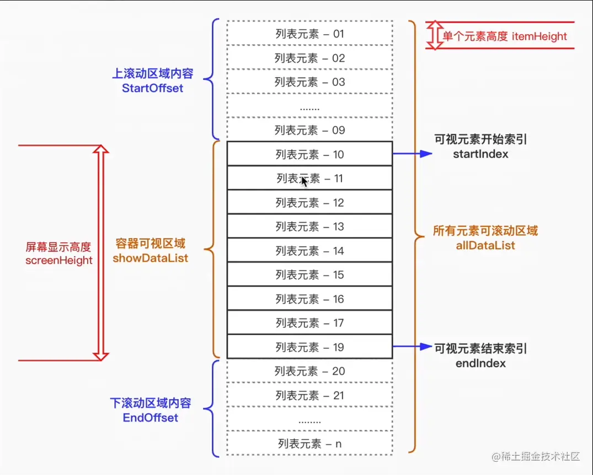

# dom

## 节点层级

### Node 类型

##### Node

- 所有类型节点继承 Node 类型;

##### Node API

- Node.ELEMENT_NODE: number 静态属性: 元素节点类型常量(值为 1);
- Node.ATTRIBUTE_NODE: number 静态属性: 属性节点类型常量(值为 2);
- Node.TEXT_NODE: number 静态属性: 文本节点类型常量(值为 3);
- Node.CDATA_SECTION_NODE: number 静态属性: CDATA 节点类型常量(值为 4);
- Node.ENTITY_REFERENCE_NODE: number 静态属性: 实体引用节点类型常量(值为 5);
- Node.ENTITY_NODE: number 静态属性: 实体节点类型常量(值为 6);
- Node.PROCESSING_INSTRUCTION_NODE: number 静态属性: 处理指令节点类型常量(值为 7);
- Node.COMMENT_NODE: number 静态属性: 注释节点类型常量(值为 8);
- Node.DOCUMENT_NODE: number 静态属性: 文档节点类型常量(值为 9);
- Node.DOCUMENT_TYPE_NODE: number 静态属性: 文档类型节点类型常量(值为 10);
- Node.DOCUMENT_FRAGMENT_NODE: number 静态属性: 文档片段节点类型常量(值为 11);
- Node.NOTATION_NODE: number 静态属性: 符号节点类型常量(值为 12);
- Node.prototype.nodeType: number 实例属性: 获取节点类型;
- Node.prototype.nodeName: string 实例属性: 存储节点对应元素标签名;
- Node.prototype.nodeValue: string | null 实例属性: 获取或设置节点值;
- Node.prototype.childNodes: NodeList 实例属性: 存储子节点数组;
- Node.prototype.parentNode: Node | null 实例属性: 存储父节点;
- Node.prototype.previousSibling: Node | null 实例属性: 表示前一个同级节点, 第一个其值为 null;
- Node.prototype.nextSibling: Node | null 实例属性: 表示后一个同级节点, 最后一个其值为 null;
- Node.prototype.firstChild: Node | null 实例属性: 表示第一个子节点;
- Node.prototype.lastChild: Node | null 实例属性: 表示最后一个子节点;
- Node.prototype.hasChildNodes(): boolean 实例方法: 判断是否具有子节点;
- Node.prototype.appendChild(node: Node): Node 实例方法: 在末尾添加子节点;
- Node.prototype.insertBefore(newNode: Node, referenceNode: Node | null): Node 实例方法: 在指定节点前插入新节点;
- Node.prototype.replaceChild(newChild: Node, oldChild: Node): Node 实例方法: 替换子节点;
- Node.prototype.removeChild(child: Node): Node 实例方法: 移除子节点;
- Node.prototype.cloneNode(deep?: boolean): Node 实例方法: 克隆节点, deep 为 true 时深复制;

### Document 类型

##### Document 类型

- 表示整个 HTML 界面;

##### Document API

- Document.prototype.nodeType: number 实例属性: 值为 9, 表示文档节点;
- Document.prototype.nodeName: string 实例属性: 值为 "#document";
- Document.prototype.documentElement: HTMLElement | null 实例属性: 恒指向 html 标签;
- Document.prototype.body: HTMLElement | null 实例属性: 恒指向 body 标签;
- Document.prototype.title: string 实例属性: 表示 title 标签内容, 可读写;
- Document.prototype.URL: string 实例属性: 表示完整 URL, 只读;
- Document.prototype.domain: string 实例属性: 表示域名, 可读写, 但只能为 URL 的子串;

### Element 类型

##### Element 类型

- 表示 HTML 元素;

##### Element API

- Element.prototype.nodeType: number 实例属性: 值为 1, 表示元素节点;
- Element.prototype.nodeName: string 实例属性: 标签名(全大写);
- Element.prototype.tagName: string 实例属性: 元素标签名(全大写);
- Element.prototype.id: string 实例属性: 元素 id 属性;
- Element.prototype.className: string 实例属性: 元素 class 属性;
- Element.prototype.classList: DOMTokenList 实例属性: 元素的 class 集合;
- Element.prototype.innerHTML: string 实例属性: 元素内部的 HTML 内容;
- Element.prototype.outerHTML: string 实例属性: 元素及其内部 HTML 内容;
- Element.prototype.textContent: string 实例属性: 元素及其后代的文本内容;
- Element.prototype.getAttribute(qualifiedName: string): string | null 实例方法: 获取属性对应字符串;
- Element.prototype.setAttribute(qualifiedName: string, value: string): void 实例方法: 设置属性;
- Element.prototype.removeAttribute(qualifiedName: string): void 实例方法: 移除属性;
- Element.prototype.hasAttribute(qualifiedName: string): boolean 实例方法: 判断是否具有指定属性;
- Element.prototype.getAttributeNames(): string[] 实例方法: 返回元素所有属性名;
- Document.prototype.createElement(tagName: string): HTMLElement 实例方法: 创建指定标签的元素;

### Text 类型

##### Text 类型

- 表示文本节点;

##### Text API

- Text.prototype.nodeType: number 实例属性: 值为 3, 表示文本节点;
- Text.prototype.nodeName: string 实例属性: 值为 "#text";
- Text.prototype.nodeValue: string | null 实例属性: 节点中的文本;
- Text.prototype.data: string 实例属性: 文本节点的字符数据;
- Text.prototype.length: number 实例属性: 获取字符数量;
- Text.prototype.appendData(data: string): void 实例方法: 添加文本;
- Text.prototype.deleteData(offset: number, count: number): void 实例方法: 从 offset 开始删除 count 个字符;
- Text.prototype.insertData(offset: number, data: string): void 实例方法: 在 offset 插入 data;
- Text.prototype.replaceData(offset: number, count: number, data: string): void 实例方法: 用 data 替换 [offset, offset + count) 的文本;
- Text.prototype.splitText(offset: number): Text 实例方法: 在 offset 拆分文本, 返回拆分后的新文本节点;
- Text.prototype.substringData(offset: number, count: number): string 实例方法: 提取 [offset, offset + count) 的文本;
- Document.prototype.createTextNode(data: string): Text 实例方法: 创建文本节点;

##### 文本节点数量

- 文本内容的每个元素规定最多只能有一个文本节点;
- 但可以存在多个文本节点;

### Comment 类型

- nodeType 为 8;
- nodeName 为 `#comment`;
- nodeValue 为注释内容;

### CDATASection 类型

- nodeType 为 8;
- nodeName 为 `#cdata-section`;
- nodeValue 为 CDATA 区块的内容;

### DocumentType 类型

- nodeType 为 10;
- nodeName 为文档类型的名称;
- parentNode 值为 Document 对象;

### DocumentFragment 类型

- nodeType 为 11;
- nodeName 为 `#document-fragment`;

### Attr 类型

- nodeType 为 2;
- nodeName 为属性名;
- nodeValue 为属性值;
- 一般不使用, 推荐使用 getAttribute(), removeAttribute()和 setAttribute()方法

## DOM 编程

### 动态脚本

```typescript
let script = document.createElement("script");
script.src = "foo.js";
document.body.appendChild(script);
```

### 动态样式

```typescript
let link = document.createElement("link");
link.rel = "stylesheet";
link.type = "text/css";
link.href = "styles.css";
let head = document.getElementsByTagName("head")[0];
head.appendChild(link);
```

### NodeList 对象

- NodeList 实时反应 DOM 结构;
- 下列代码会永久循环;

```typescript
let divs = document.getElementsByTagName("div");
for (let i = 0; i < divs.length; ++i) {
  let div = document.createElement("div");
  document.body.appendChild(div);
}
```

## MutationObserver

### MutationObserver

- 监控 DOM 变化, 异步执行回调;

### MutationObserver API

- MutationObserver(callback: (mutations: MutationRecord[], observer: MutationObserver) => void): MutationObserver 构造函数: 创建 MutationObserver 实例, DOM 变化时异步执行回调;
- MutationObserver.prototype.disconnect(): void 实例方法: 停止观察, 不会终止 MutationObserver 实例, 后续可以重新调用 observe() 开始观察;
- MutationObserver.prototype.observe(target: Node, options?: MutationObserverInit): void 实例方法: 开始观察指定节点;
- MutationObserver.prototype.takeRecords(): MutationRecord[] 实例方法: 获取已检测到但尚未处理的变动记录;

### MutationRecord

- 发生变化的 DOM 的元数据;

### MutationObserverInit

- 设置观察 DOM 变化的选项;

```typescript
let observer = new MutationObserver((mutationRecords) =>
  console.log(mutationRecords.map((x) => x.target)),
);
observer.observe(childA, { attributes: true });
observer.disconnect();
```

## IntersectionObserver

### IntersectionObserver

- 异步监听多个目标元素与观测元素的交叉状态;

### IntersectionObserver API

- IntersectionObserver(callback: (entries: IntersectionObserverEntry[], observer: IntersectionObserver) => void, options?: IntersectionObserverInit): IntersectionObserver 构造函数: 异步监听多个目标元素与视口的交叉状态;
- IntersectionObserver.prototype.observe(target: Element): void 实例方法: 开始观察指定元素;
- IntersectionObserver.prototype.unobserve(target: Element): void 实例方法: 停止观察指定元素;
- IntersectionObserver.prototype.disconnect(): void 实例方法: 停止观察所有元素;
- IntersectionObserver.prototype.takeRecords(): IntersectionObserverEntry[] 实例方法: 获取所有未处理的交叉记录;

### IntersectionObserverEntry

- 目标元素的元数据;

### IntersectionObserverInit

- IntersectionObserver 的配置选项;

```typescript
const observer = new IntersectionObserver(callback, options);
const callback = (entries, observer) => {
  entries.forEach((entry) => {
    // ...
  });
};
observer.observe(target);
observer.unobserve(target);
```

## 元素查询和元素遍历

### 元素查询

- Document.prototype.querySelector(selectors: string): Element | null 实例方法: 通过 css 选择符匹配 DOM 元素, 返回第一个满足条件的元素, 未找到返回 null;
- Document.prototype.querySelectorAll(selectors: string): NodeList 实例方法: 通过 css 选择符匹配 DOM 元素, 返回所有元素的 NodeList;
- Element.prototype.matches(selectors: string): boolean 实例方法: 匹配成功返回 true, 反之返回 false;
- Document.prototype.getElementById(elementId: string): HTMLElement | null 实例方法: 通过 id 获取元素;
- Document.prototype.getElementsByClassName(classNames: string): HTMLCollection 实例方法: 通过类名获取元素集合;
- Document.prototype.getElementsByTagName(qualifiedName: string): HTMLCollection 实例方法: 通过标签名获取元素集合;
- Document.prototype.getElementsByName(name: string): NodeList 实例方法: 通过 name 属性获取元素集合;

### 元素遍历

##### DOM 属性

- Element.prototype.childElementCount: number 实例属性: 子元素数量 (不包含文本节点);
- Element.prototype.firstElementChild: Element | null 实例属性: 第一个 Element 类型的子元素;
- Element.prototype.lastElementChild: Element | null 实例属性: 最后一个 Element 类型的子元素;
- Element.prototype.previousElementSibling: Element | null 实例属性: 前一个 Element 类型的同级元素;
- Element.prototype.nextElementSibling: Element | null 实例属性: 后一个 Element 类型的同级元素;

##### NodeIterator

- Document.prototype.createNodeIterator(root: Node, whatToShow?: number, filter?: NodeFilter | null): NodeIterator 实例方法: 创建 NodeIterator 进行深度优先遍历;
- NodeIterator.prototype.nextNode(): Node | null 实例方法: 返回遍历中的下一个节点;
- NodeIterator.prototype.previousNode(): Node | null 实例方法: 返回遍历中的上一个节点;
- NodeIterator.prototype.root: Node 实例属性: 遍历的根节点;
- NodeIterator.prototype.whatToShow: number 实例属性: 过滤器常量, 表示哪些节点类型会被返回;
- NodeIterator.prototype.filter: NodeFilter | null 实例属性: 用于筛选节点的 NodeFilter;

##### TreeWalker

- Document.prototype.createTreeWalker(root: Node, whatToShow?: number, filter?: NodeFilter | null): TreeWalker 实例方法: 创建 TreeWalker 进行深度优先遍历, 是 NodeIterator 的高级版;
- TreeWalker.prototype.nextNode(): Node | null 实例方法: 返回遍历中的下一个节点;
- TreeWalker.prototype.previousNode(): Node | null 实例方法: 返回遍历中的上一个节点;
- TreeWalker.prototype.parentNode(): Node | null 实例方法: 遍历至当前节点的父节点;
- TreeWalker.prototype.firstChild(): Node | null 实例方法: 遍历至当前节点的第一个子节点;
- TreeWalker.prototype.lastChild(): Node | null 实例方法: 遍历至当前节点的最后一个子节点;
- TreeWalker.prototype.nextSibling(): Node | null 实例方法: 遍历至当前节点的下一个同级节点;
- TreeWalker.prototype.previousSibling(): Node | null 实例方法: 遍历至当前节点的上一个同级节点;
- TreeWalker.prototype.currentNode: Node 实例属性: 当前节点;
- TreeWalker.prototype.root: Node 实例属性: 遍历的根节点;
- TreeWalker.prototype.whatToShow: number 实例属性: 过滤器常量, 表示哪些节点类型会被返回;
- TreeWalker.prototype.filter: NodeFilter | null 实例属性: 用于筛选节点的 NodeFilter;

## html5

### 焦点管理

- Document.prototype.activeElement: Element | null 实例属性: 始终为当前拥有焦点的 DOM 元素;
- Document.prototype.hasFocus(): boolean 实例方法: 检测 document 是否具有焦点;
- HTMLElement.prototype.focus(): void 实例方法: 使元素获得焦点;
- HTMLElement.prototype.blur(): void 实例方法: 使元素失去焦点;

```typescript
let button = document.getElementById("myButton");
button.focus();
console.log(document.activeElement === button); // true
console.log(document.hasFocus()); // true
```

### 滚动

- Element.prototype.scrollIntoView(arg?: boolean | { block?: "start" | "center" | "end" | "nearest"; inline?: "start" | "center" | "end" | "nearest"; behavior?: "auto" | "smooth" }): void 实例方法: 滚动元素使其可见;

```typescript
document.forms[0].scrollIntoView({ behavior: "smooth", block: "start" }); // behavior 默认为 auto
```

### HTMLDocument 拓展

- Document.prototype.readyState: "loading" | "interactive" | "complete" 实例属性: 表示文档是否加载完成;
- Document.prototype.compatMode: "CSS1Compat" | "BackCompat" 实例属性: 表示 html 渲染模式;
- Document.prototype.head: HTMLElement | null 实例属性: 指向 <head> 元素;
- Document.prototype.characterSet: string 实例属性: 表示文档字符集, 如 "UTF-8";

### 自定义数据属性

- data-xxx 属性: 自定义数据属性, 用于存储自定义数据;

```typescript
<div id="myDiv" data-appId="12345" data-myname="Nicholas"></div>
```

### 插入标记

##### innerHTML 属性

- 读写所有后代元素的 HTML 字符串;

```typescript
div.innerHTML = "Hello & welcome, <b>\"reader\"!</b>"
// 等效于下列代码
<div id="content">Hello &amp; welcome, <b>&quot;reader&quot;!</b></div>
```

##### outerHTML 属性

- 读写元素及其所有后代元素的 HTML 字符串;

```typescript
div.outerHTML = "<p>This is a paragraph.</p>";
// 等效于下列代码
let p = document.createElement("p");
p.appendChild(document.createTextNode("This is a paragraph."));
div.parentNode.replaceChild(p, div);
```

##### insertAdjacentHTML() 与 insertAdjacentText()

- Element.prototype.insertAdjacentHTML(position: "beforebegin" | "afterbegin" | "beforeend" | "afterend", text: string): void 实例方法: 在指定位置插入 HTML 字符串;
- Element.prototype.insertAdjacentText(position: "beforebegin" | "afterbegin" | "beforeend" | "afterend", text: string): void 实例方法: 在指定位置插入文本;

```typescript
element.insertAdjacentHTML("beforebegin", "<p>Hello world!</p>");
element.insertAdjacentText("beforebegin", "Hello world!");
```

##### 安全问题

- innerHTML 会导致 XSS 攻击;

## 样式

### 操作元素样式

```typescript
let myDiv = document.getElementById("myDiv");
// 设置 css 属性
myDiv.style.backgroundColor = "red";
// 读写对应的 css 代码
myDiv.style.cssText = "width: 25px; height: 100px; background-color: green";
// 获取 css 属性值
value = myDiv.style.getPropertyValue(prop);
// 删除 css 属性
myDiv.style.removeProperty("border");
// 迭代  css 属性
for (let i = 0, len = myDiv.style.length; i < len; i++) {
  console.log(myDiv.style[i]); // 或者用 myDiv.style.item(i)
}
```

### 操作样式表

```typescript
// 遍历样式表
let sheet = null;
for (let i = 0, len = document.styleSheets.length; i < len; i++) {
  sheet = document.styleSheets[i];
  console.log(sheet.href);
}
// 操作 css 规则
let sheet = document.styleSheets[0];
let rules = sheet.cssRules || sheet.rules; // 取得规则集合
let rule = rules[0]; // 取得第一条规则
console.log(rule.selectorText); // "div.box"
console.log(rule.style); // CSSStyleDeclaration
// 创建 css 规则
sheet.insertRule("body { background-color: silver }", 0); // 使用 DOM 方法
// 删除 css 规则
sheet.deleteRule(0);
```

### getComputedStyle

- Window.prototype.getComputedStyle(element: Element, pseudoElt?: string): CSSStyleDeclaration 全局方法: 获得指定元素的伪元素(可选)最终使用的 css;

```typescript
const box = document.getElementById("box");
const style = window.getComputedStyle(box, "after");
const height = style.getPropertyValue("height");
const width = style.getPropertyValue("width");
```

## 元素尺寸



##### 偏移尺寸

- 元素占用的视觉空间, 只读属性;
- 可视 content + padding + border;
- ltrb 为对于 border 到父元素的偏移值;

```typescript
const left = element.offsetLeft;
const width = element.offsetWidth;
```

##### 客户端尺寸

- 元素可见内容空间, 只读属性;
- 可视 content + padding;
- ltrb 为对应 border 宽度;

```typescript
const left = element.clientLeft;
const height = element.clientHeight;
```

##### 滚动尺寸

- 元素总可见内容空间, 只读属性;
- 总 content + padding;
- ltrb 为可见内容控件的偏移量;

```typescript
const left = element.scrollLeft;
const width = element.scrollWidth;
```

##### 客户端存储和滚动尺寸的关系

- 没有滚动条时, 两者相等;
- 具有滚动条时, 滚动偏移量 + 客户端尺寸 = 滚动尺寸;

##### getBoundingClientRect

- Element.prototype.getBoundingClientRect(): DOMRect 实例方法: 返回 DOMRect 对象, 提供元素位置和尺寸;
- DOMRect.prototype.x: number 实例属性: 元素左边界相对于视口的 x 坐标;
- DOMRect.prototype.y: number 实例属性: 元素上边界相对于视口的 y 坐标;
- DOMRect.prototype.width: number 实例属性: 元素的宽度;
- DOMRect.prototype.height: number 实例属性: 元素的高度;
- DOMRect.prototype.top: number 实例属性: 元素上边界相对于视口顶部的距离;
- DOMRect.prototype.right: number 实例属性: 元素右边界相对于视口左侧的距离;
- DOMRect.prototype.bottom: number 实例属性: 元素下边界相对于视口顶部的距离;
- DOMRect.prototype.left: number 实例属性: 元素左边界相对于视口左侧的距离;



```typescript
const box = document.getElementById("box");
const rect = box.getBoundingClientRect();
```

## Range

### Range

- DOM 范围对象, 表示文档中的一个片段;

### Range API

- Document.prototype.createRange(): Range 实例方法: 创建 DOM 范围对象, 表示文档中的一个片段;
- Range.prototype.selectNode(node: Node): void 实例方法: 选择整个节点;
- Range.prototype.selectNodeContents(node: Node): void 实例方法: 选择节点的子节点;
- Range.prototype.startContainer: Node 实例属性: 范围的起始节点;
- Range.prototype.endContainer: Node 实例属性: 范围的结束节点;
- Range.prototype.startOffset: number 实例属性: 范围的起始偏移量;
- Range.prototype.endOffset: number 实例属性: 范围的结束偏移量;
- Range.prototype.commonAncestorContainer: Node 实例属性: 范围的公共祖先容器;
- Range.prototype.setStart(refNode: Node, offset: number): void 实例方法: 设置范围的起始位置;
- Range.prototype.setEnd(refNode: Node, offset: number): void 实例方法: 设置范围的结束位置;
- Range.prototype.setStartBefore(refNode: Node): void 实例方法: 将范围的起始位置设置为 refNode 之前;
- Range.prototype.setStartAfter(refNode: Node): void 实例方法: 将范围的起始位置设置为 refNode 之后;
- Range.prototype.setEndBefore(refNode: Node): void 实例方法: 将范围的结束位置设置为 refNode 之前;
- Range.prototype.setEndAfter(refNode: Node): void 实例方法: 将范围的结束位置设置为 refNode 之后;
- Range.prototype.extractContents(): DocumentFragment 实例方法: 提取范围内容并返回文档片段;
- Range.prototype.deleteContents(): void 实例方法: 删除范围内容;
- Range.prototype.cloneContents(): DocumentFragment 实例方法: 克隆范围内容并返回文档片段;
- Range.prototype.insertNode(node: Node): void 实例方法: 在范围起始位置插入节点;
- Range.prototype.surroundContents(newParent: Node): void 实例方法: 用新节点包围范围内容;

```typescript
// 创建 DOM 范围对象
let range = document.createRange();
```

## 最佳实践

### 判断元素是否在可视区域

##### 基本原理

- 使用 getBoundingClientRect() API;
  - 判断 top/left/bottom/right 和 window.innerHeight/ window.innerWidth 的关系;
- 使用 IntersectionObserver() API;

##### 部分包含

- getBoundingClientRect();
  - top > 0 且小于 window.innerHeight, left 同理
- IntersectionObserver();
  - intersectionRatio 为 (0, 1);

##### 完全包含

- getBoundingClientRect();
  - top > 0 且 bottom < window.innerHeight, left/right 同理
- IntersectionObserver();
  - intersectionRatio 为 1;

### 上拉加载和下拉刷新

##### 上拉加载

- 上拉加载即当前页面触底的动作;
- 判断出发上拉加载的标签的位置;
- 设置一个触发上拉加载的阈值 distance;
- 如果其 scrollTop + clientHeight >= scrollHeight - distance, 触发对应操作;

```typescript
if (scrollTop + clientHeight >= scrollHeight - distance) {
  console.log("开始加载数据");
}
```

##### 下拉刷新

- 页面处于顶部, 用户进行下拉刷新;
- 监听 touchstart, touchmove 和 touchend 事件;
- touchstart 记录 y 轴起始位置;
- touchmove 记录 y 轴移动方向;
  - 如果向下移动, element 使用 translateY 移动相同距离;
- touchend 触发下拉刷新事件, element translateY 设置为 0;

### 大数据显示

##### 直接渲染

- 不推荐;

##### setTimeout 分页渲染

- 首页将数据分为若干页;
- 使用 setTimeout 逐页渲染;

##### requestAnimationFrame

- 即将 setTimeout 替换为 requestAnimationFrame;

##### df + requestAnimationFrame

- 文档碎片 + requestAnimationFrame;
  - 减少重排和重绘;
  - 在内存中进行运算, 减少对真实 DOM 的操作;

##### 懒加载

- 首先进行分页, 在页尾放置一个空节点;
- 使用 getBoundingClientRect 或 IntersectionObserver 观察空节点是否在视图内;
- 若出现在视图内, 在渲染下一页内容;

##### 虚拟列表

- 见虚拟列表;

### 虚拟列表

##### 虚拟列表

- 根据可视区域和列表内容;
- 监听用户滚动事件, 动态截取部分列表内容渲染到页面上;

##### 实现机制

- 固定可视区高度 showHeight 和列表子项高度 itemHeight;
- 计算起始位置和终止位置索引;
  - 计算索引时可设置一个缓存值, 避免滑动效果卡顿;
  - 计算可视区列表起始索引 start;
    - start = Math.floor(scrollTop/itemHeight) - buffer;
  - 计算可视区列表终止索引 end;
    - end = start + Math.ceil(showHeight/itemHeight) + buffer;
- 监听滚动事件, 根据起始和终止索引, 渲染部分列表内容;
  - 列表元素使用 absolute 布局;
  - 根据 startIndex 设置 top;
  - 对应回调函数使用节流机制, 避免频繁渲染;


